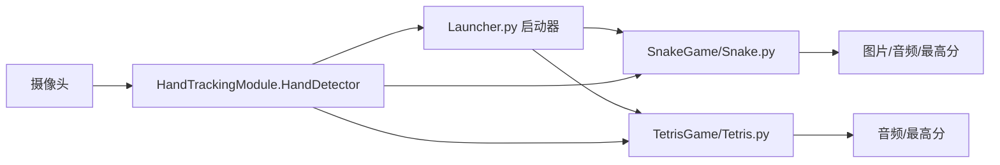

# 架构说明

## 总览

## 模块职责

| 模块 | 职责 |
| --- | --- |
| `HandTrackingModule.py` | 对 MediaPipe Hands 做轻量封装，输出手部关键点、左右手类型、手指伸展状态和距离计算。 |
| `Launcher.py` | 打开摄像头并展示游戏选择界面，通过食指悬停进入对应游戏。 |
| `SnakeGame/Snake.py` | 维护贪吃蛇状态、碰撞检测、分数、暂停/重开/退出按钮和 OpenCV 渲染。 |
| `TetrisGame/Tetris.py` | 维护俄罗斯方块网格、方块旋转/移动/下落、消行计分、暂停/重开/退出和 Pygame 渲染。 |

## 数据流

1. 摄像头采集 BGR 图像帧。
2. `HandDetector.findHands` 将图像送入 MediaPipe，并返回关键点坐标。
3. 游戏层根据手指状态和关键点位置识别动作命令。
4. 游戏逻辑更新状态，例如蛇身、食物、障碍物、方块位置、分数和最高分。
5. 渲染层将游戏画面、摄像头画面、按钮、分数和提示合成到窗口。

## 设计取舍

- 启动器和两个游戏保留为独立入口，方便分别调试和演示。
- 最高分保存在本地文本文件中，适合单机演示；这些运行时文件不会提交到 Git。
- 手势识别封装保持轻量，便于后续替换为更复杂的手势分类模型。
- 音频加载采用容错处理，缺少音频设备或素材时不阻断游戏主体逻辑。
